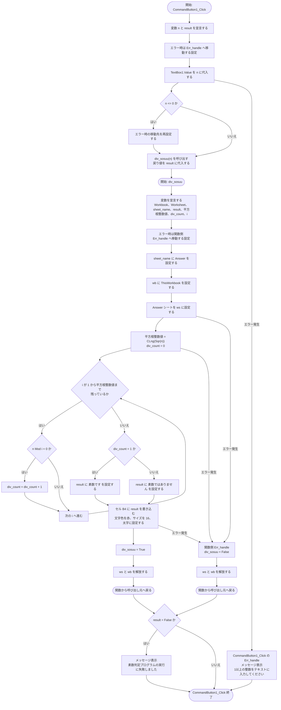

```mermaid
flowchart TD
    A(["開始: CommandButton1_Click"])
    B["変数 n と result を宣言する"]
    C["エラー時は Err_handle へ移動する設定"]
    D["TextBox1.Value を n に代入する"]
    E{"n &lt;= 0 か"}
    F["エラー時の移動先を再設定する"]
    G["div_sosuu(n) を呼び出す<br>戻り値を result に代入する"]

    H(["開始: div_sosuu"])
    H1["変数を宣言する<br>Workbook、Worksheet、sheet_name、result、平方根整数値、div_count、i"]
    H2["エラー時は関数側 Err_handle へ移動する設定"]
    H3["sheet_name に Answer を設定する"]
    H4["wb に ThisWorkbook を設定する"]
    H5["Answer シートを ws に設定する"]
    H6["平方根整数値 = CLng(Sqr(n))<br>div_count = 0"]
    L{"i が 1 から平方根整数値まで<br>残っているか"}
    M{"n Mod i = 0 か"}
    N["div_count = div_count + 1"]
    O["次の i へ進む"]
    P{"div_count = 1 か"}
    Q1["result に 素数です を設定する"]
    Q2["result に 素数ではありません を設定する"]
    Q3["セル B4 に result を書き込む<br>文字色を赤、サイズを 16、太字に設定する"]
    R["div_sosuu = True"]
    S["ws と wb を解放する"]
    T(["関数から呼び出し元へ戻る"])

    EH["関数側 Err_handle<br>div_sosuu = False"]
    EH2["ws と wb を解放する"]
    EH3(["関数から呼び出し元へ戻る"])

    I{"result = False か"}
    J["メッセージ表示<br>素数判定プログラムの実行に失敗しました"]
    K(["CommandButton1_Click 終了"])

    X["CommandButton1_Click の Err_handle<br>メッセージ表示<br>1以上の整数をテキストに入力してください"]
    
    A --> B
    B --> C
    C --> D
    D --> E
    D -->|"エラー発生"| X
    E -->|"はい"| F
    E -->|"いいえ"| G
    F --> G

    G --> H
    H --> H1
    H1 --> H2
    H2 --> H3
    H3 --> H4
    H4 --> H5
    H5 --> H6
    H5 -->|"エラー発生"| EH
    H6 --> L
    H6 -->|"エラー発生"| EH

    L -->|"はい"| M
    L -->|"いいえ"| P
    M -->|"はい"| N
    M -->|"いいえ"| O
    N --> O
    O --> L

    P -->|"はい"| Q1
    P -->|"いいえ"| Q2
    Q1 --> Q3
    Q2 --> Q3
    Q3 --> R
    Q3 -->|"エラー発生"| EH
    R --> S
    S --> T

    EH --> EH2
    EH2 --> EH3

    T --> I
    EH3 --> I
    I -->|"はい"| J
    I -->|"いいえ"| K
    J --> K
    X --> K
```